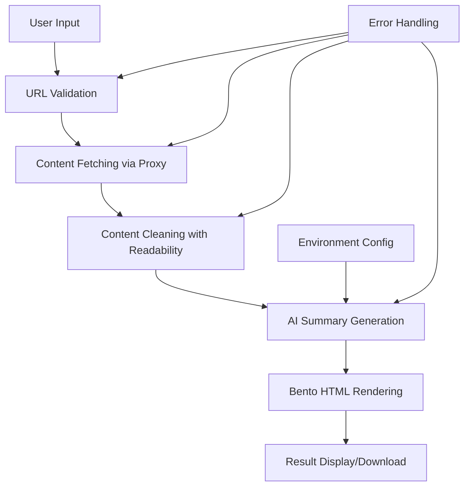

# Design Document

## Overview

This design document outlines the implementation of a WeChat article parsing system that extracts content from WeChat public account articles and generates AI-powered summaries in Bento card format. The system uses a proxy service for content fetching, OpenAI-compatible API for AI processing, and provides real-time feedback to users.

## Architecture

### High-Level Architecture



### System Components

1. **Input Validation Layer**: Validates WeChat article URLs
2. **Proxy Service Layer**: Handles CORS and content fetching
3. **Content Processing Layer**: Cleans and structures article content
4. **AI Service Layer**: Generates structured summaries using OpenAI-compatible API
5. **Rendering Layer**: Creates Bento-style HTML output
6. **State Management Layer**: Manages application state and user feedback

## Components and Interfaces

### 1. Environment Configuration Service

```typescript
interface EnvironmentConfig {
  apiKey: string;
  proxyUrl: string;
  apiBaseUrl: string;
  maxRetries: number;
  timeout: number;
}

class ConfigService {
  private config: EnvironmentConfig;
  
  constructor() {
    this.config = this.loadFromEnv();
    this.validateConfig();
  }
  
  private loadFromEnv(): EnvironmentConfig {
    return {
      apiKey: import.meta.env.VITE_API_KEY || '',
      proxyUrl: import.meta.env.VITE_PROXY_URL || 'https://yunwu.zeabur.app',
      apiBaseUrl: import.meta.env.VITE_API_BASE_URL || 'https://yunwu.zeabur.app/v1',
      maxRetries: parseInt(import.meta.env.VITE_MAX_RETRIES || '3'),
      timeout: parseInt(import.meta.env.VITE_TIMEOUT || '30000'),
    };
  }
  
  private validateConfig(): void {
    if (!this.config.apiKey) {
      throw new Error('VITE_API_KEY is required in environment variables');
    }
  }
  
  getConfig(): EnvironmentConfig {
    return { ...this.config };
  }
}
```

### 2. URL Validation Service

```typescript
interface ValidationResult {
  isValid: boolean;
  error?: string;
  normalizedUrl?: string;
}

class URLValidationService {
  private readonly WECHAT_URL_PATTERN = /^https:\/\/mp\.weixin\.qq\.com\/s\/.+/;
  
  validate(url: string): ValidationResult {
    if (!url.trim()) {
      return { isValid: false, error: '请输入文章链接' };
    }
    
    if (!this.WECHAT_URL_PATTERN.test(url)) {
      return { 
        isValid: false, 
        error: '仅支持微信公众号文章链接 (mp.weixin.qq.com)' 
      };
    }
    
    return { 
      isValid: true, 
      normalizedUrl: this.normalizeUrl(url) 
    };
  }
  
  private normalizeUrl(url: string): string {
    // Remove tracking parameters and normalize URL
    const urlObj = new URL(url);
    const cleanParams = ['__biz', 'mid', 'idx', 'sn'];
    
    // Keep only essential parameters
    const newSearchParams = new URLSearchParams();
    cleanParams.forEach(param => {
      const value = urlObj.searchParams.get(param);
      if (value) newSearchParams.set(param, value);
    });
    
    urlObj.search = newSearchParams.toString();
    return urlObj.toString();
  }
}
```

### 3. Content Fetching Service

```typescript
interface FetchResult {
  content: string;
  metadata: {
    title?: string;
    author?: string;
    publishTime?: string;
  };
}

class ContentFetchingService {
  private config: EnvironmentConfig;
  private retryCount = 0;
  
  constructor(config: EnvironmentConfig) {
    this.config = config;
  }
  
  async fetchArticleContent(url: string): Promise<FetchResult> {
    const proxyUrl = `${this.config.proxyUrl}/fetch`;
    
    try {
      const response = await fetch(proxyUrl, {
        method: 'POST',
        headers: {
          'Content-Type': 'application/json',
        },
        body: JSON.stringify({ url }),
        signal: AbortSignal.timeout(this.config.timeout),
      });
      
      if (!response.ok) {
        throw new Error(`HTTP ${response.status}: ${response.statusText}`);
      }
      
      const html = await response.text();
      return this.extractContent(html);
      
    } catch (error) {
      if (this.retryCount < this.config.maxRetries) {
        this.retryCount++;
        await this.delay(1000 * this.retryCount); // Exponential backoff
        return this.fetchArticleContent(url);
      }
      throw new Error(`内容获取失败: ${error.message}`);
    }
  }
  
  private extractContent(html: string): FetchResult {
    // Use Readability algorithm to extract clean content
    const parser = new DOMParser();
    const doc = parser.parseFromString(html, 'text/html');
    
    // Extract metadata
    const title = doc.querySelector('h1')?.textContent?.trim() || '';
    const author = doc.querySelector('.profile_nickname')?.textContent?.trim() || '';
    const publishTime = doc.querySelector('.publish_time')?.textContent?.trim() || '';
    
    // Extract main content
    const contentElement = doc.querySelector('#js_content') || doc.body;
    const content = this.cleanContent(contentElement.textContent || '');
    
    return {
      content,
      metadata: { title, author, publishTime }
    };
  }
  
  private cleanContent(text: string): string {
    return text
      .replace(/\s+/g, ' ') // Normalize whitespace
      .replace(/\n{3,}/g, '\n\n') // Limit consecutive newlines
      .trim();
  }
  
  private delay(ms: number): Promise<void> {
    return new Promise(resolve => setTimeout(resolve, ms));
  }
}
```

### 4. AI Summary Service

```typescript
interface SummaryRequest {
  content: string;
  metadata: {
    title?: string;
    author?: string;
    publishTime?: string;
  };
}

interface SummaryResponse {
  title: string;
  keyPoints: string[];
  summary: string;
  tags: string[];
  readingTime: number;
  sentiment: 'positive' | 'neutral' | 'negative';
}

class AISummaryService {
  private config: EnvironmentConfig;
  
  constructor(config: EnvironmentConfig) {
    this.config = config;
  }
  
  async generateSummary(request: SummaryRequest): Promise<SummaryResponse> {
    const chunks = this.chunkContent(request.content);
    const summaries = await Promise.all(
      chunks.map(chunk => this.processSingleChunk(chunk, request.metadata))
    );
    
    return this.mergeSummaries(summaries, request.metadata);
  }
  
  private chunkContent(content: string, maxTokens = 3000): string[] {
    const words = content.split(' ');
    const chunks: string[] = [];
    
    for (let i = 0; i < words.length; i += maxTokens) {
      chunks.push(words.slice(i, i + maxTokens).join(' '));
    }
    
    return chunks;
  }
  
  private async processSingleChunk(content: string, metadata: any): Promise<Partial<SummaryResponse>> {
    const prompt = this.buildPrompt(content, metadata);
    
    const response = await fetch(`${this.config.apiBaseUrl}/chat/completions`, {
      method: 'POST',
      headers: {
        'Content-Type': 'application/json',
        'Authorization': `Bearer ${this.config.apiKey}`,
      },
      body: JSON.stringify({
        model: 'gemini-1.5-flash',
        messages: [
          {
            role: 'system',
            content: '你是一个专业的文章摘要助手，擅长提取关键信息并生成结构化摘要。'
          },
          {
            role: 'user',
            content: prompt
          }
        ],
        temperature: 0.3,
        max_tokens: 1000,
        response_format: { type: 'json_object' }
      }),
    });
    
    if (!response.ok) {
      throw new Error(`AI服务错误: ${response.status} ${response.statusText}`);
    }
    
    const result = await response.json();
    return JSON.parse(result.choices[0].message.content);
  }
  
  private buildPrompt(content: string, metadata: any): string {
    return `
请分析以下文章内容并生成结构化摘要，以JSON格式返回：

文章标题：${metadata.title || '未知'}
作者：${metadata.author || '未知'}
发布时间：${metadata.publishTime || '未知'}

文章内容：
${content}

请返回以下JSON格式的摘要：
{
  "title": "文章标题（如果原标题不够清晰可以优化）",
  "keyPoints": ["关键点1", "关键点2", "关键点3", "关键点4", "关键点5"],
  "summary": "200字以内的整体总结",
  "tags": ["相关标签1", "相关标签2", "相关标签3"],
  "readingTime": 预估阅读时间（分钟，数字），
  "sentiment": "positive/neutral/negative"
}

要求：
1. keyPoints应该是文章的核心观点，每个点控制在30字以内
2. summary应该概括文章主要内容和价值
3. tags应该反映文章的主题和领域
4. readingTime基于内容长度估算
5. sentiment分析文章的整体情感倾向
    `;
  }
  
  private mergeSummaries(summaries: Partial<SummaryResponse>[], metadata: any): SummaryResponse {
    // Merge multiple chunk summaries into final result
    const allKeyPoints = summaries.flatMap(s => s.keyPoints || []);
    const allTags = summaries.flatMap(s => s.tags || []);
    
    return {
      title: summaries[0]?.title || metadata.title || '文章摘要',
      keyPoints: this.deduplicateAndLimit(allKeyPoints, 6),
      summary: summaries.map(s => s.summary).join(' ').substring(0, 200),
      tags: this.deduplicateAndLimit(allTags, 5),
      readingTime: Math.max(...summaries.map(s => s.readingTime || 0)),
      sentiment: this.determineSentiment(summaries.map(s => s.sentiment).filter(Boolean))
    };
  }
  
  private deduplicateAndLimit<T>(items: T[], limit: number): T[] {
    return [...new Set(items)].slice(0, limit);
  }
  
  private determineSentiment(sentiments: string[]): 'positive' | 'neutral' | 'negative' {
    const counts = sentiments.reduce((acc, s) => {
      acc[s] = (acc[s] || 0) + 1;
      return acc;
    }, {} as Record<string, number>);
    
    return Object.keys(counts).reduce((a, b) => counts[a] > counts[b] ? a : b) as any || 'neutral';
  }
}
```

### 5. Bento Renderer Service

```typescript
interface BentoRenderOptions {
  theme: 'light' | 'dark';
  compact: boolean;
}

class BentoRendererService {
  renderToHTML(summary: SummaryResponse, options: BentoRenderOptions = { theme: 'light', compact: false }): string {
    const themeClass = options.theme === 'dark' ? 'dark' : '';
    const compactClass = options.compact ? 'compact' : '';
    
    return `
<!DOCTYPE html>
<html lang="zh-CN" class="${themeClass}">
<head>
    <meta charset="UTF-8">
    <meta name="viewport" content="width=device-width, initial-scale=1.0">
    <title>${summary.title}</title>
    <script src="https://cdn.tailwindcss.com"></script>
    <script>
        tailwind.config = {
            darkMode: 'class',
            theme: {
                extend: {
                    colors: {
                        border: "hsl(var(--border))",
                        background: "hsl(var(--background))",
                        foreground: "hsl(var(--foreground))",
                    }
                }
            }
        }
    </script>
    <style>
        :root {
            --background: 0 0% 100%;
            --foreground: 222.2 84% 4.9%;
            --border: 214.3 31.8% 91.4%;
        }
        .dark {
            --background: 222.2 84% 4.9%;
            --foreground: 210 40% 98%;
            --border: 217.2 32.6% 17.5%;
        }
    </style>
</head>
<body class="bg-background text-foreground min-h-screen p-4">
    <div class="max-w-4xl mx-auto">
        ${this.renderBentoGrid(summary, compactClass)}
    </div>
    
    <script>
        // Theme toggle functionality
        function toggleTheme() {
            document.documentElement.classList.toggle('dark');
        }
        
        // Add theme toggle button
        document.addEventListener('DOMContentLoaded', function() {
            const button = document.createElement('button');
            button.innerHTML = '🌓';
            button.className = 'fixed top-4 right-4 p-2 rounded-full bg-gray-200 dark:bg-gray-800 hover:bg-gray-300 dark:hover:bg-gray-700 transition-colors';
            button.onclick = toggleTheme;
            document.body.appendChild(button);
        });
    </script>
</body>
</html>
    `;
  }
  
  private renderBentoGrid(summary: SummaryResponse, compactClass: string): string {
    return `
<div class="grid grid-cols-1 md:grid-cols-3 lg:grid-cols-4 gap-4 ${compactClass}">
    <!-- Title Card -->
    <div class="md:col-span-2 lg:col-span-3 bg-white dark:bg-gray-800 rounded-lg p-6 shadow-lg border border-border">
        <h1 class="text-2xl font-bold mb-2">${summary.title}</h1>
        <div class="flex items-center gap-4 text-sm text-gray-600 dark:text-gray-400">
            <span>📖 ${summary.readingTime} 分钟阅读</span>
            <span class="sentiment-${summary.sentiment}">
                ${this.getSentimentIcon(summary.sentiment)} ${this.getSentimentText(summary.sentiment)}
            </span>
        </div>
    </div>
    
    <!-- Summary Card -->
    <div class="bg-white dark:bg-gray-800 rounded-lg p-6 shadow-lg border border-border">
        <h2 class="text-lg font-semibold mb-3">📝 核心总结</h2>
        <p class="text-sm text-gray-700 dark:text-gray-300 leading-relaxed">${summary.summary}</p>
    </div>
    
    <!-- Key Points Cards -->
    ${summary.keyPoints.map((point, index) => `
    <div class="bg-white dark:bg-gray-800 rounded-lg p-4 shadow-lg border border-border hover:shadow-xl transition-shadow">
        <div class="flex items-start gap-3">
            <span class="flex-shrink-0 w-6 h-6 bg-blue-100 dark:bg-blue-900 text-blue-600 dark:text-blue-400 rounded-full flex items-center justify-center text-sm font-semibold">
                ${index + 1}
            </span>
            <p class="text-sm text-gray-700 dark:text-gray-300 leading-relaxed">${point}</p>
        </div>
    </div>
    `).join('')}
    
    <!-- Tags Card -->
    <div class="md:col-span-2 lg:col-span-4 bg-white dark:bg-gray-800 rounded-lg p-4 shadow-lg border border-border">
        <h3 class="text-sm font-semibold mb-3 text-gray-600 dark:text-gray-400">🏷️ 相关标签</h3>
        <div class="flex flex-wrap gap-2">
            ${summary.tags.map(tag => `
            <span class="px-3 py-1 bg-gray-100 dark:bg-gray-700 text-gray-700 dark:text-gray-300 rounded-full text-sm">
                ${tag}
            </span>
            `).join('')}
        </div>
    </div>
</div>
    `;
  }
  
  private getSentimentIcon(sentiment: string): string {
    switch (sentiment) {
      case 'positive': return '😊';
      case 'negative': return '😔';
      default: return '😐';
    }
  }
  
  private getSentimentText(sentiment: string): string {
    switch (sentiment) {
      case 'positive': return '积极';
      case 'negative': return '消极';
      default: return '中性';
    }
  }
}
```

## Data Models

### Core Data Types

```typescript
// Environment configuration
interface EnvironmentConfig {
  apiKey: string;
  proxyUrl: string;
  apiBaseUrl: string;
  maxRetries: number;
  timeout: number;
}

// Processing state
interface ProcessingState {
  step: 'idle' | 'validating' | 'fetching' | 'processing' | 'rendering' | 'complete' | 'error';
  progress: number;
  message: string;
  error?: string;
}

// Article content
interface ArticleContent {
  url: string;
  content: string;
  metadata: {
    title?: string;
    author?: string;
    publishTime?: string;
  };
}

// AI summary result
interface SummaryResponse {
  title: string;
  keyPoints: string[];
  summary: string;
  tags: string[];
  readingTime: number;
  sentiment: 'positive' | 'neutral' | 'negative';
}

// Final output
interface BentoOutput {
  summary: SummaryResponse;
  html: string;
  downloadUrl?: string;
}
```

## Error Handling

### Error Types and Recovery Strategies

1. **Configuration Errors**
   - Missing API key → Show setup instructions
   - Invalid proxy URL → Fallback to alternative proxies

2. **Network Errors**
   - Timeout → Retry with exponential backoff
   - Connection failed → Try alternative endpoints

3. **Content Extraction Errors**
   - Invalid URL → Show format requirements
   - Content not found → Suggest manual input

4. **AI Service Errors**
   - Rate limit → Queue and retry later
   - Invalid response → Fallback to simpler processing

5. **Rendering Errors**
   - HTML too large → Automatic download
   - Display issues → Provide raw text fallback

## Testing Strategy

### Unit Tests
- URL validation logic
- Content extraction algorithms
- AI response parsing
- HTML rendering output

### Integration Tests
- End-to-end article processing flow
- API service integration
- Error handling scenarios
- Performance benchmarks

### User Acceptance Tests
- Complete user journey testing
- Cross-browser compatibility
- Mobile responsiveness
- Accessibility compliance

## Performance Considerations

### Optimization Strategies

1. **Content Processing**
   - Implement streaming for large articles
   - Use Web Workers for heavy processing
   - Cache processed results locally

2. **API Efficiency**
   - Implement request batching
   - Use compression for large payloads
   - Implement intelligent retry logic

3. **Rendering Performance**
   - Lazy load Bento cards
   - Optimize CSS for smooth animations
   - Implement virtual scrolling for large summaries

4. **Memory Management**
   - Clean up large content after processing
   - Implement garbage collection for cached data
   - Monitor memory usage in development