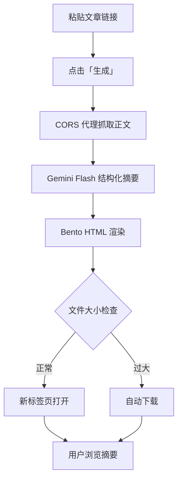

# 格致 BenSight - 微信公众号文章 Bento 摘要工具

> 粘贴微信公众号文章链接 → 点击「生成」→ 数秒后获得一份 **Bento 风格 HTML 摘要**

## 🎯 产品愿景

将冗长的微信公众号文章转换为结构化、美观的 Bento 风格摘要，帮助用户快速获取文章核心信息。

### 核心特性

- ⚡ **高效处理**：8 秒内完成文章摘要生成
- 🎨 **美观展示**：采用 Bento 卡片式设计，支持深/浅色主题
- 🚀 **零门槛使用**：无需注册，免费试用
- 📱 **响应式设计**：完美适配桌面和移动设备
- 🔗 **便捷分享**：生成的 HTML 可在线浏览或下载保存

## 🛠️ 技术栈

### 前端框架
- **React 18** + **Vite** + **TypeScript** - 现代化开发体验
- **TailwindCSS** + **shadcn/ui** - 美观的 UI 组件库
- **next-themes** - 深/浅色主题切换
- **TanStack Query** - 数据获取和状态管理

### 核心功能
- **Gemini 1.5 Flash** - AI 驱动的文章结构化摘要
- **CORS 代理** - 解决跨域文章抓取问题
- **Readability** - 智能正文提取和清洗
- **Bento Grid** - 卡片式布局系统

### 开发工具
- **ESLint** + **Prettier** - 代码规范
- **Lucide React** - 矢量图标库
- **React Hook Form** + **Zod** - 表单验证

## 🚀 快速开始

### 环境要求
- Node.js 18+ 
- npm 或 yarn

### 安装依赖
```bash
# 克隆项目
git clone <YOUR_GIT_URL>
cd <YOUR_PROJECT_NAME>

# 安装依赖
npm install

# 启动开发服务器
npm run dev
```

### 构建部署
```bash
# 生产构建
npm run build

# 预览构建结果
npm run preview
```

## 📁 项目结构

```
src/
├── components/          # UI 组件
│   ├── BentoCard.tsx   # Bento 卡片组件
│   ├── ThemeToggle.tsx # 主题切换按钮
│   └── ui/             # shadcn/ui 组件
├── lib/                # 核心逻辑
│   ├── readability.ts  # 文章正文提取
│   ├── extract.ts      # AI 摘要生成
│   └── render.ts       # HTML 渲染
├── pages/              # 页面组件
│   └── Index.tsx       # 主页面
├── hooks/              # 自定义 Hooks
│   └── useGenerate.ts  # 摘要生成逻辑
└── main.tsx           # 应用入口
```

## 🔄 工作流程



## 🎯 核心功能

### 1. URL 输入与验证
- 仅支持 `https://mp.weixin.qq.com/` 链接
- 实时输入验证和错误提示

### 2. 文章内容抓取
- 通过 CORS 代理获取文章内容
- 使用 Readability 算法提取正文
- 智能去除广告和无关内容

### 3. AI 摘要生成
- 基于 Gemini 1.5 Flash 模型
- 结构化 JSON 输出
- Token 优化的分块处理

### 4. Bento 风格渲染
- 响应式卡片布局
- 优雅的动画效果
- 深/浅色主题支持

## 📊 性能指标

| 指标 | 目标值 |
|------|--------|
| 90% 端到端生成时长 | < 8 秒 |
| HTML 在线打开率 | ≥ 70% |
| 移动端适配率 | 100% |

## 🔧 开发指南

### 本地开发
```bash
npm run dev
```
访问 `http://localhost:5173` 查看应用

### 代码规范
```bash
# 代码检查
npm run lint

# 类型检查
npx tsc --noEmit
```

### 环境变量
创建 `.env.local` 文件：
```env
VITE_YUNWU_API_KEY=your_api_key_here
VITE_CORS_PROXY_URL=https://cors.isomorphic-git.org/
```

## 🚀 部署

### Netlify / Vercel
项目支持静态部署到 Netlify 或 Vercel：

1. 连接 GitHub 仓库
2. 设置构建命令：`npm run build`
3. 设置发布目录：`dist`
4. 配置环境变量

### 自定义域名
支持绑定自定义域名，详见平台文档。

## 🤝 贡献指南

1. Fork 项目
2. 创建功能分支：`git checkout -b feature/amazing-feature`
3. 提交更改：`git commit -m 'Add amazing feature'`
4. 推送分支：`git push origin feature/amazing-feature`
5. 提交 Pull Request

## 📄 许可证

本项目采用 MIT 许可证 - 查看 [LICENSE](LICENSE) 文件了解详情。

## 🔗 相关链接

- [Lovable 项目页面](https://lovable.dev/projects/4a469227-036a-4abc-81bc-b5c7bae5f2f2)
- [技术文档](./wechat_bento_spec.md)
- [问题反馈](https://github.com/your-repo/issues)
