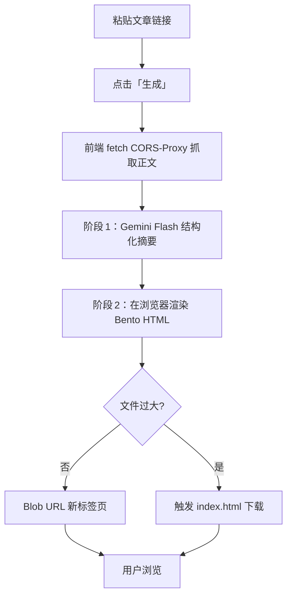

# **格致 BenSight** —— 微信公众号文章 Bento 摘要工具

> **版本：v0.4 (2025‑07‑24)**

---

## 1 产品概述

### 1.1 一句话愿景

粘贴微信公众号文章链接 → 点击「生成」→ 数秒后获得一份 **Bento 风格 HTML 摘要**，可直接在新标签页浏览（若托管失败则自动提供下载）。

### 1.2 产品目标

- **效率** ：把长文压缩到 8 秒内可读结构化摘要。
- **美观** ：采用卡片式视觉，方便分享 / 收藏。
- **低门槛** ：MVP 免登录，免费试用（使用官方 API Key）。

### 1.3 目标用户

- 快速过滤大量微信文章的知识工作者、研究者、内容策展人。

### 1.4 成功指标 (KPI)

| 指标          | 目标     |
| ----------- | ------ |
| 90% 端到端生成时长 | < 8 秒  |
| HTML 在线打开率  | ≥ 70 % |
| 次周留存率       | ≥ 40 % |

---

## 2 用户故事 (核心)

| ID | 角色   | 需求                     | 价值       |
| -- | ---- | ---------------------- | -------- |
| U1 | 新访客  | 不注册即可生成摘要              | 快速验证工具价值 |
| U2 | 进阶用户 | 使用自己的 OpenAI/Yunwu Key | 避免共享额度限制 |
| U3 | 任意用户 | 点击打开在线 HTML；若失败能下载     | 始终可查看结果  |

---

## 3 用户流程 (纯前端 + CORS 代理)



---

## 4 功能规格

| 模块                | 描述                                        | Must/Nice |
| ----------------- | ----------------------------------------- | --------- |
| URL 输入校验          | 仅接受 `https://mp.weixin.qq.com/...`        | **Must**  |
| 文章抓取              | 前端 fetch → 公共 CORS Proxy + Readability 清洗 | **Must**  |
| **阶段 1：结构化提取**    | Yunwu API Gemini 1.5 Flash → 返回 JSON      | **Must**  |
| **阶段 2：Bento 渲染** | Tailwind CSS Grid + JSON → HTML 字符串       | **Must**  |
| 浏览器下载             | HTML 过大或用户点击「下载」时，创建 Blob 并触发 download    | **Must**  |
| 深/浅色切换            | 跟随系统 + 手动按钮 (next-themes)                 | **Must**  |
| 加载/错误状态           | Skeleton & Toast 提示                       | **Must**  |
| Token/调用统计        | 本地 LocalStorage 计数                        | **Nice**  |
| 后端日志 / DB         | Supabase (可选，后期)                          | Future    |

### 4.1 MVP 不包含

- 登录与权限系统
- 持久化数据库
- Serverless / Edge Functions

---

## 5 技术栈

| 层         | 选择                                         | 说明              |
| --------- | ------------------------------------------ | --------------- |
| **前端框架**  | **React + Vite + TypeScript** (Lovable 默认) | 快速构建            |
| UI 组件     | **TailwindCSS + shadcn/ui**                | Bento 卡片 & 主题切换 |
| 图标库       | **lucide-react** via CDN / npm             | 矢量图标            |
| 主题管理      | **next-themes**                            | 深/浅色            |
| 状态管理 / 网络 | **TanStack Query**                         | 请求缓存 & 错误处理     |
| LLM 调用    | **fetch → Yunwu API (Gemini 1.5 Flash)**   | 结构化摘要           |
| 抓取代理      | **公共 CORS Proxy** 或自建 Cloudflare Worker    | 解决跨域            |
| Dev 工具    | Cursor, Claude Code, Kiro                  | 协作              |
| 部署        | Netlify / Vercel Static                    | 纯静态，如需后台再迁移     |

---

## 6 Token 消耗优化 & Prompt 拆分

同 v0.3 方案：正文分块 + 双阶段处理 → 节省 25‑35% Token；详情略。

---

## 7 Lovable 生成脚手架 Prompt

> **将以下文本复制到 Lovable，生成 React + Vite 项目骨架：**

```txt
# 项目
名称: 格致 BenSight
目标: 微信公众号 URL → JSON 摘要 → Bento HTML (纯前端)

# 技术栈
React + Vite + TypeScript + TailwindCSS + shadcn/ui + lucide-react
状态管理: TanStack Query
主题: next-themes (深/浅色)

# 目录结构
/src
  ├─ components/
  │   ├─ BentoCard.tsx   // 卡片组件
  │   └─ ThemeToggle.tsx // 主题切换按钮
  ├─ lib/
  │   ├─ readability.ts  // 文章正文提取
  │   ├─ extract.ts      // 调用 Gemini 获取 JSON
  │   └─ render.ts       // JSON → HTML 字符串
  ├─ pages/
  │   └─ Home.tsx        // 输入表单 + 结果预览
  ├─ hooks/
  │   └─ useGenerate.ts  // TanStack Query 调用链
  └─ main.tsx            // 应用入口

# 核心需求
1. 首页表单: 粘贴 mp.weixin.qq.com 链接 → 按钮「生成」
2. useGenerate Hook:
   a. fetch 文章 via CORS Proxy + Readability 清洗
   b. 分块调用 extract() → 汇总 JSON
   c. 调用 render() 生成单页 HTML 字符串
3. 成功后：
   - 创建 Blob URL → window.open 新标签页
   - 失败时 Toast 错误
4. 样式:
   - Bento Grid (CSS Grid) 适配桌面/移动
   - 卡片 hover 上浮 & 阴影
5. 代码要求:
   - 使用 Tailwind CDN
   - 关键逻辑含英文注释
   - ESLint + Prettier 基础配置

# 输出
完整可运行的 Vite 项目 (package.json 等)，无需 README。
```

---

## 8 下一步行动

1. 将 **Lovable Prompt** 发送给 Lovable → 生成仓库
2. 在本地 `npm install && npm run dev` 验证 UI & 生成流程
3. 若 CORS 受限，临时使用 `https://cors.isomorphic-git.org/` 代理
4. 完善 Token 统计 / 下载功能 / 主题切换动画
5. 再根据需要接入 Supabase 或服务器端功能

> 有任何修改意见，直接告诉我或在 Canvas 批注 ✨

